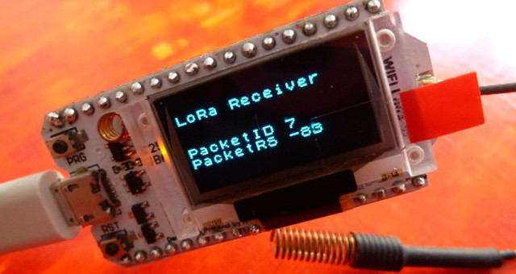

# airrohr-esp32
ESP32 Port of the airrohr particulates sensor. See http://luftdaten.info how to build your own 

## Intro

ESP32 Port of the airrohr firmware from luftdaten.info: https://github.com/opendata-stuttgart/sensors-software/airrohr-firmware

This Sketch was tested against a Heltec Wifi32 LoRa Module only. 

 
 

* https://github.com/Heltec-Aaron-Lee/WiFi_Kit_series/tree/master/SchematicDiagram
* https://www.hackerspace-ffm.de/wiki/index.php?title=Heltec_Wifi_LoRa_32
* https://hackaday.io/project/26991-esp32-board-wifi-lora-32

Use it on your own risk.

ATTENTION: currently, the LoRa sending is just a first try, not standard conform, not
optimized! for "production usage", please use WLAN.

## ToDo

* implement proper LoRa Packet sending
* byte encoding instead of string
* add more compile options for different sensors
* code clean up
* debug heap stack overflow for config webpages

## Usage
1. Connect the SDS011 to the PINs configured in the sketch (PIN 12 and 13 are preconfigured)
2. Connect the 5V and GND pins
3. Connect the BME280 sensor to PIN 34 & 35, 3.3v and GND.
4. Fill in your LoRa keys
6. Write the sketch to the ESP32 module

## Quick explanation what this does
1. sleeps for a given amount of time.
2. spins up the fan for some time to clean the fan and the housing (1 minute recommened).
3. takes 10 samples of sensor data (pm2.5 and pm10)
4. calculates the median of each to avoid outlier
5. takes the current humidity and temperature values
6. send them via LoRa and/or WLAN (configure via WebGui)

